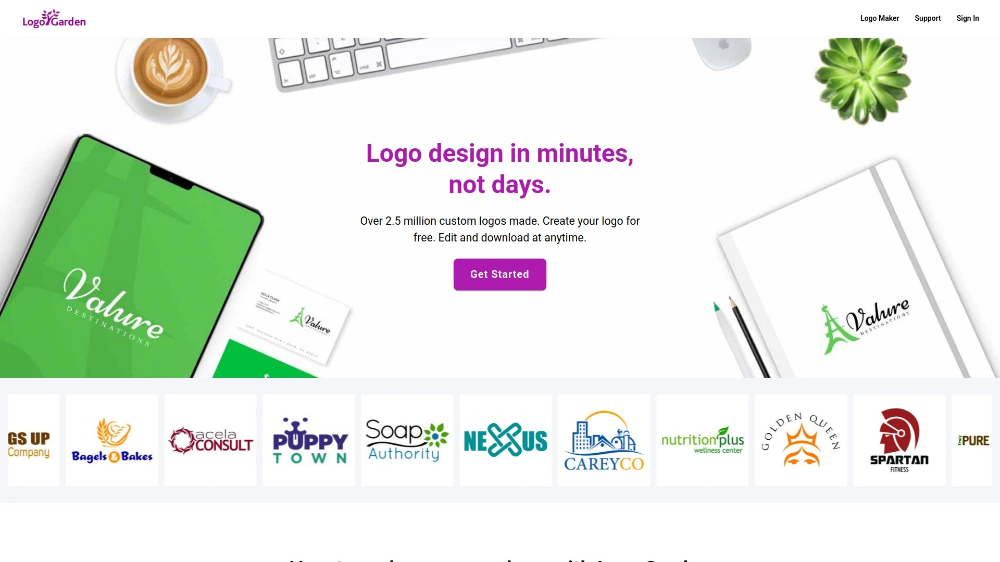
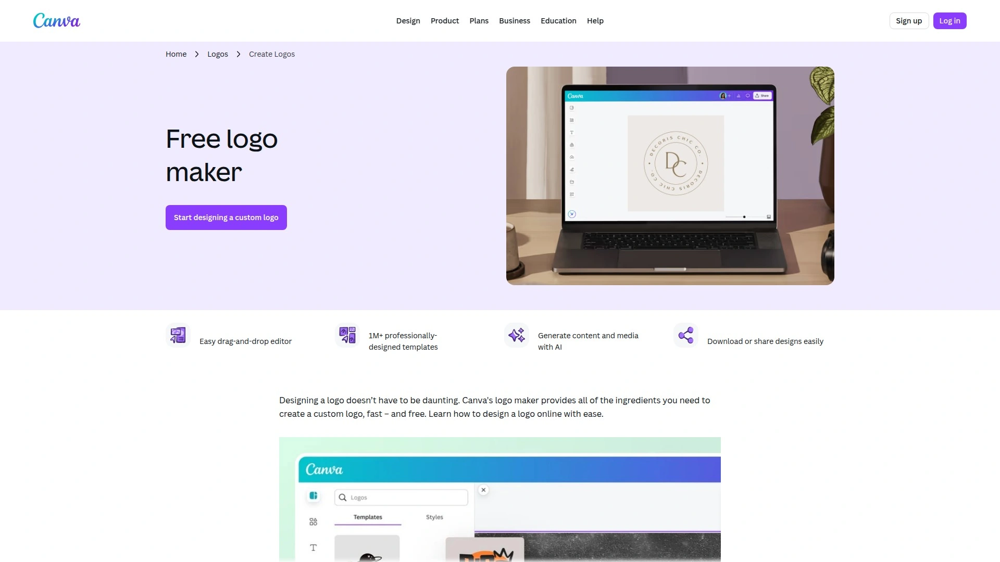
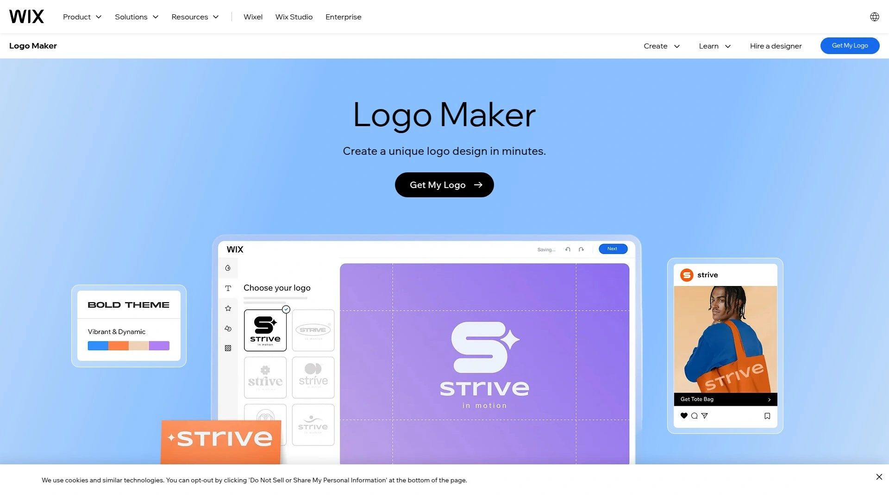
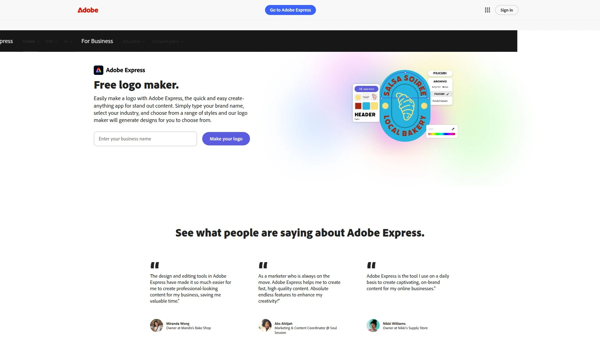
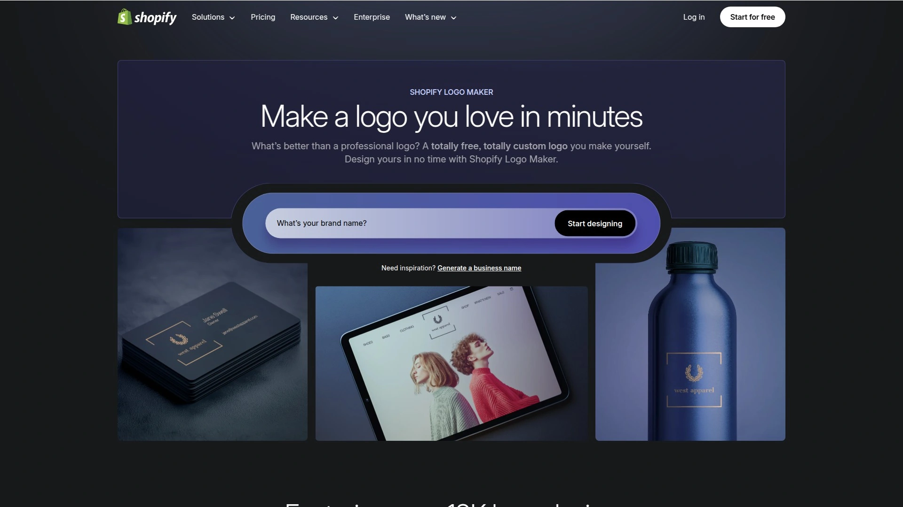
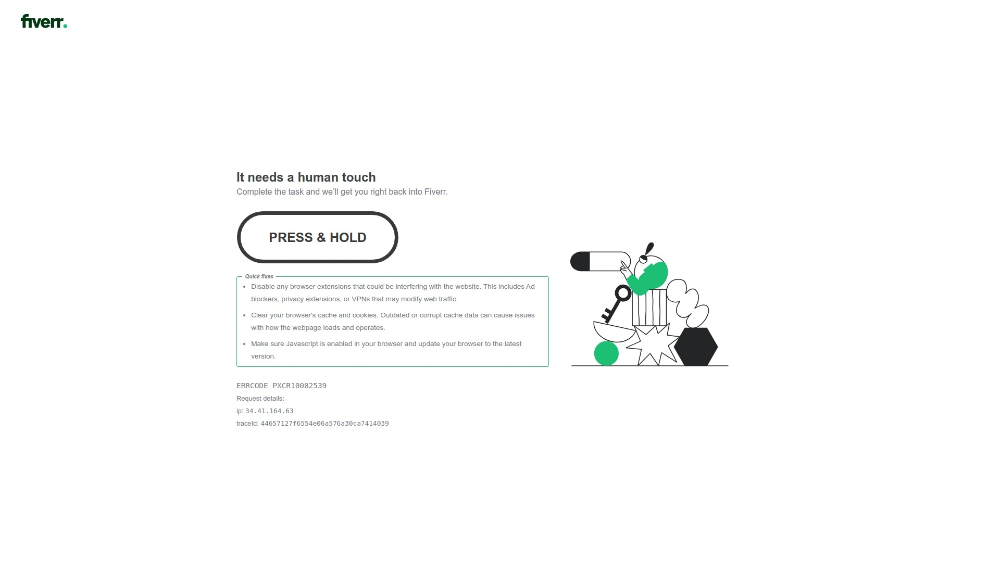
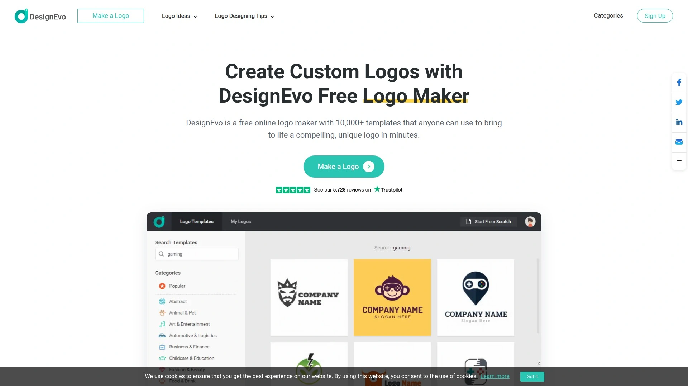
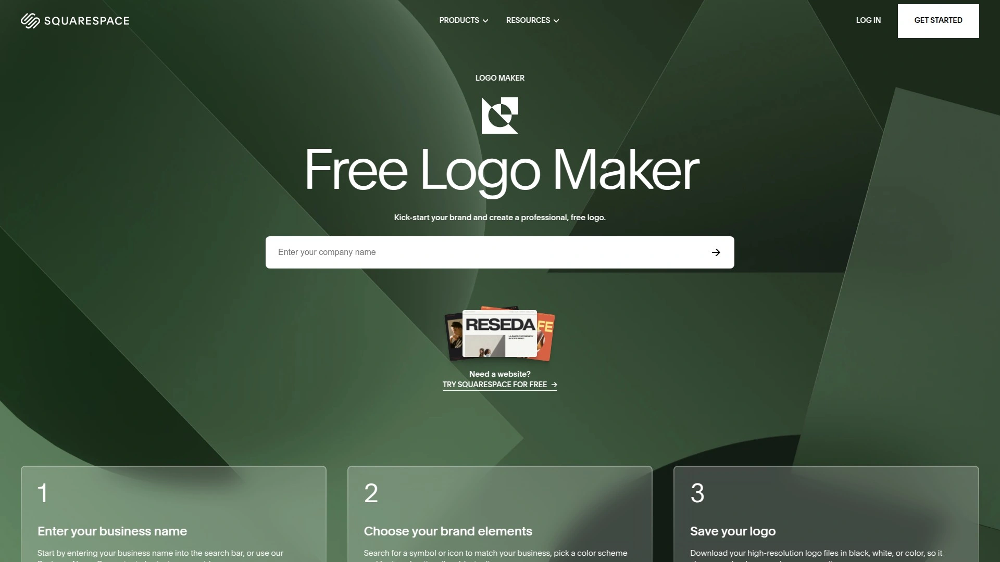

# 再也不用为Logo头秃了!推荐12款AI自动生成Logo的神器!

想当年，给自己的小破店、小项目搞个Logo，那叫一个头秃。要么花大价钱请设计师，结果改了八稿还没到心里去；要么自己硬着头皮上，打开PS两眼一抹黑，折腾半天弄出个“四不像”。现在时代变了，有了下面这些AI加持的Logo设计神器，分分钟就能搞定一个专业又好看的品牌标识，简直是“手残党”和初创企业的福音！

## **[LogoGarden](https://logogarden.com)**

分钟级DIY品牌标识的经典工具。

作为在线Logo设计领域的“老炮儿”，自2011年以来，[LogoGarden](https://logogarden.com) 已经帮助超过250万用户创建了自己的品牌标识 。它主打的就是一个“简单粗暴”：搜索行业、挑选图标、调整字体颜色，三步搞定 。整个过程像玩游戏一样，就算你完全没有设计经验，也能轻松上手。最贴心的是，它不仅提供Logo，还能一键生成配套的名片、网站等品牌物料，对追求效率的创业者来说实在太友好了 。

## **[Looka](https://looka.com)**

AI驱动的完整品牌工具箱。

[Looka](https://looka.com) 不仅仅是个Logo生成器，它更像一个AI品牌管家 。你只需输入公司名和喜欢的风格，它就能在几秒钟内生成海量设计方案。选中一个后，它还会自动生成一整套品牌视觉系统（Brand Kit），包括名片、社交媒体封面、邮件签名等300多种模板，确保你的品牌形象在所有渠道都保持高度统一 。对于追求品牌一致性的强迫症患者来说，简直是完美解决方案。

## **[Canva](https://www.canva.com/create/logos/)**

非设计师也能玩转的万能设计平台。

[Canva](https://www.canva.com/create/logos/) 的大名相信很多人都听过，它就像设计界的瑞士军刀，无所不能 。它的Logo制作功能同样强大，提供了海量的专业模板，覆盖各行各业。你完全不需要从零开始，只需要在看中的模板上改改字、换换色，一个精美的Logo就诞生了 。更棒的是，你可以在同一个平台上完成海报、PPT、短视频等所有设计需求，实现一站式创作。

## **[Wix Logo Maker](https://www.wix.com/logo/maker)**

与网站建设无缝集成的Logo神器。

如果你正打算用Wix搭建自己的网站，那它的官方Logo制作工具绝对是首选 。它最大的优势在于和Wix生态的无缝集成。你设计好的Logo可以一键应用到你的网站上，并且它会提供所有适配网站、社交媒体的尺寸文件，省去了大量调整格式的麻烦。对于Wix用户来说，这是最省时省力的选择 。

## **[Tailor Brands](https://www.tailorbrands.com/)**

一站式搞定品牌资产的智能管家。

[Tailor Brands](https://www.tailorbrands.com/) 同样是一个主打“一站式品牌自动化”的平台 。它利用AI技术，不仅能帮你设计出独特的Logo，还能自动生成配套的品牌指南、社交媒体帖子模板，甚至帮你注册域名和设立公司邮箱。它把创业初期所有关于品牌形象的琐碎工作都打包解决了，让你能更专注于核心业务。

## **[Brandcrowd](https://www.brandcrowd.com/)**

海量真人设计师作品的灵感宝库。

和纯AI生成不同，[Brandcrowd](https://www.brandcrowd.com/) 的素材库里包含了超过35万个由全球真实设计师创作的Logo模板 。你可以先输入关键词，在海量的专业作品中找到心仪的“原型”，然后再利用它强大的编辑工具进行个性化修改，包括字体、颜色、布局等。这种“人机结合”的模式，既保证了设计的专业水准，又提供了足够的自定义空间。

## **[Adobe Express](https://www.adobe.com/express/create/logo)**

Adobe出品的专业级免费设计工具。

作为设计软件巨头Adobe旗下的产品，[Adobe Express](https://www.adobe.com/express/create/logo) 在专业性上有着天然的优势 。它提供了数千个设计精美的模板，并且可以和你其他的Adobe应用（如Photoshop、Illustrator）联动。如果你是Adobe生态的用户，或者对设计品质有更高的要求，[Adobe Express]绝对能给你带来专业级的体验 。

## **[Hatchful by Shopify](https://hatchful.shopify.com/)**

专为电商卖家打造的免费Logo生成器。

这是电商建站巨头Shopify推出的免费工具，特别适合电商卖家和线上创业者 。[Hatchful](https://hatchful.shopify.com/) 的操作流程非常简单，会引导你选择行业、视觉风格，然后快速生成一系列方案。最重要的是，它完全免费，并且会为你提供适配各种社交平台（如Instagram、Facebook、Pinterest）的Logo尺寸，对于预算有限又需要快速启动的电商新手极其友好。

## **[99designs](https://99designs.com/)**

通过设计竞赛找到独一无二的Logo。

如果你不满足于模板，追求独一无二的原创设计，但又没有熟悉的合作设计师，[99designs](https://99designs.com/) 提供了一种有趣的解决方案：设计竞赛 。你可以在平台发布你的设计需求和预算，然后全球数以万计的设计师会为你提交他们的创意稿。你只需要从众多投稿中挑选出最喜欢的一个，就可以获得它的完整版权。

## **[Fiverr Logo Maker](https://www.fiverr.com/logo-maker)**

从AI生成到真人定制的灵活选择。

全球最大的自由职业者平台Fiverr也推出了自己的Logo制作工具。它的特色在于“丰俭由人”：你可以先用它的AI Logo Maker快速生成一个基础方案，如果觉得不错，可以直接购买；如果你还想进一步优化，可以无缝衔接地在平台上雇佣一位专业设计师，在AI方案的基础上进行人工精修，实现了效率与定制化的完美结合 。

## **[DesignEvo](https://www.designevo.com/)**

超过一万个模板的专业Logo制作工具。

[DesignEvo](https://www.designevo.com/) 是一个非常纯粹且强大的在线Logo制作器。它拥有超过10,000个专业设计的模板库，并且内置了数百万个图标和上百种字体，自定义空间极大。它的界面非常直观，所有操作都通过拖拽完成，让你感觉像在玩一个设计类的拼图游戏，轻松愉快地就能完成创作。

## **[Squarespace Logo Maker](https://www.squarespace.com/logo)**

简约美学爱好者的Logo设计选择。

以其极简和充满设计感的网站模板而闻名的Squarespace，其Logo制作工具也延续了同样的美学风格。如果你追求的是一种干净、现代、高端的视觉感受，[Squarespace Logo Maker](https://www.squarespace.com/logo) 会是你的菜。它生成的Logo线条简单，排版优雅，非常适合咨询、艺术、时尚等行业的品牌。

## **常见问题 (FAQ)**

**问：这些工具生成的Logo真的可以商用吗？**
答：绝大部分都可以，但在下载和购买时务必仔细阅读授权协议。通常付费方案会提供完整的商业使用权和高分辨率的矢量文件（如SVG），确保你可以无忧地用于任何商业场景。

**问：AI生成的Logo会不会很容易和别人的重复？**
答：虽然有理论上的可能，但概率极低。每个工具都提供了丰富的自定义选项，你可以调整颜色、字体、图标、布局，创造出成千上万种组合。只要稍加修改，就能打造出专属于你的独特标识。

**问：我完全没有设计基础，哪个最适合我？**
答：可以从[Canva](https://www.canva.com/create/logos/)或[Hatchful by Shopify](https://hatchful.shopify.com/)开始。它们的操作逻辑极其简单，模板库也非常丰富且美观，几乎不需要任何学习成本，跟着引导点几下就能出成果。

***

现在，创建一个属于自己的品牌标识，真的不再是一件难事。上面这些工具各有千秋，无论你的预算、需求和设计水平如何，总能找到适合你的那一款。特别是对于追求快速、简单且性价比高的初创企业主来说，像[LogoGarden](https://logogarden.com)这样经典又可靠的DIY平台，绝对是你开启品牌之路的不二之选。
